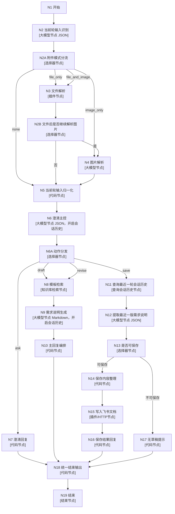

# 需求澄清对话流

这版是收敛后的唯一方案，目标是先把需求澄清线跑通。

原则：

- 主流程以 `USER_INPUT + 会话历史` 为准
- 文件/图片解析是增强分支，不是阻塞条件
- 需求澄清线只做：澄清、生成需求说明、修订需求说明、保存到飞书
- 不做调研分支

## 最终流程图



## 节点配置

### N1 开始

保留系统参数：

- `USER_INPUT`
- `CONVERSATION_NAME`

保留可选补充参数：

- `uploaded_file: File`
- `uploaded_images: Array<Image>`

说明：

- 这两个参数只做附件增强入口，不做主流程唯一入口。

---

### N2 当前轮输入识别

类型：

- 大模型节点
- 输出格式 `JSON`

输入：

- `USER_INPUT <- N1.USER_INPUT`
- `uploaded_file <- N1.uploaded_file`
- `uploaded_images <- N1.uploaded_images`

输出字段：

- `attachment_mode`：String
- `current_turn_text`：String
- `input_summary`：String
- `source_note`：String

`attachment_mode` 只能取：

- `none`
- `file_only`
- `image_only`
- `file_and_image`

系统提示词：

```md
你是“当前轮输入识别助手”。

你的任务是识别本轮输入中，当前工作流是否拿到了可解析的附件来源，并判断附件模式。

attachment_mode 只能是以下之一：
- none：当前没有明确可解析的文件或图片来源
- file_only：当前有明确可解析的文件来源，没有明确图片来源
- image_only：当前有明确可解析的图片来源，没有明确文件来源
- file_and_image：当前同时有明确可解析的文件和图片来源

同时输出：
1. current_turn_text：用户本轮直接表达的文字内容
2. input_summary：本轮输入的一句话概括
3. source_note：附件来源说明，说明当前是否存在附件但无法直接解析

规则：
- 只有开始节点里确实存在结构化附件对象时，才可判定为 file_only / image_only / file_and_image
- 不要把“用户口头说我发了附件”误判成“当前工作流已经拿到可解析附件”
- 如果当前文字已足够继续，即使附件来源不明确，也不要阻塞流程
```

用户提示词：

```md
用户本轮输入：
{{USER_INPUT}}

开始节点文件参数：
{{uploaded_file}}

开始节点图片参数：
{{uploaded_images}}
```

下一节点：

- `N2A`

---

### N2A 附件模式分流

类型：

- 选择器节点

判断：

- `attachment_mode <- N2.attachment_mode`

连接：

- `none -> N5`
- `file_only -> N3`
- `image_only -> N4`
- `file_and_image -> N3`

---

### N3 文件解析

类型：

- 插件节点

输入：

- `url <- N1.uploaded_file`

输出：

- `file_text`

说明：

- 这一步只在 `attachment_mode` 明确包含文件时运行。
- 当前可落地的结构化文件来源先用 `N1.uploaded_file`。

下一节点：

- `N2B`

---

### N2B 文件后是否继续解析图片

类型：

- 选择器节点

判断：

- `attachment_mode <- N2.attachment_mode`

连接：

- `file_and_image -> N4`
- 其他 -> `N5`

---

### N4 图片解析

类型：

- 大模型节点
- 输出格式 `Markdown`
- 关闭会话历史

普通输入：

- `USER_INPUT <- N1.USER_INPUT`

视觉理解输入：

- `uploaded_images <- N1.uploaded_images`

输出：

- `image_text`

系统提示词：

```md
你是需求图片解析助手。

任务：
- 直接读取当前节点收到的图片
- 提取图片中的文字、表格、流程、界面线索
- 输出与需求相关的信息摘要

规则：
- 不要要求用户补图片链接
- 不要说“无法访问图片”，除非当前节点确实没有收到图片
- 只做内容提取，不做需求说明成稿

输出简洁 Markdown。
```

用户提示词：

```md
用户本轮输入：
{{USER_INPUT}}

请读取这些图片：
{{uploaded_images}}

输出图片中与需求有关的信息摘要。
```

下一节点：

- `N5`

---

### N5 当前轮输入归一化

类型：

- 代码节点

输入：

- `current_turn_text <- N2.current_turn_text`
- `input_summary <- N2.input_summary`
- `source_note <- N2.source_note`
- `file_text <- N3.file_text`
- `image_text <- N4.image_text`

输出：

- `normalized_turn_input`

代码：

```javascript
async function main({ params }) {
  const currentTurnText = (params.current_turn_text || "").trim();
  const inputSummary = (params.input_summary || "").trim();
  const sourceNote = (params.source_note || "").trim();
  const fileText = (params.file_text || "").trim();
  const imageText = (params.image_text || "").trim();

  const parts = [];

  if (currentTurnText) {
    parts.push(`【用户本轮直接输入】\n${currentTurnText}`);
  }

  if (inputSummary) {
    parts.push(`【本轮输入概括】\n${inputSummary}`);
  }

  if (sourceNote) {
    parts.push(`【附件来源说明】\n${sourceNote}`);
  }

  if (fileText) {
    parts.push(`【文件解析结果】\n${fileText}`);
  }

  if (imageText) {
    parts.push(`【图片解析结果】\n${imageText}`);
  }

  return {
    normalized_turn_input: parts.join("\n\n")
  };
}
```

下一节点：

- `N6`

---

### N6 澄清主控

类型：

- 大模型节点
- 输出格式 `JSON`
- 开启会话历史

输入：

- `USER_INPUT <- N1.USER_INPUT`
- `normalized_turn_input <- N5.normalized_turn_input`

输出字段：

- `mode`：String
- `clarification_output`：String
- `draft_ready_reason`：String

`mode` 只能取：

- `ask`
- `draft`
- `revise`
- `save`

系统提示词：

```md
你是需求澄清主控助手。你的目标是帮助用户完成需求澄清并形成《需求说明》。

你只能输出以下 mode 之一：
- ask
- draft
- revise
- save

判断规则：
1. 用户明确说“保存当前版本 / 写入飞书 / 确认保存” -> save
2. 如果当前会话里已经有完整《需求说明》，且用户本轮在补充、修改、纠正 -> revise
3. 如果信息已足够形成第一版《需求说明》 -> draft
4. 其他情况下 -> ask

澄清规则：
- 可以一次提出多个相关问题
- 可以使用 A/B/C/D/E 选项
- 如果适合，可用“可多选 + 可补充”
- 不要吹毛求疵
- 不要重复问已经回答过的问题
- 只问那些会影响需求说明成稿的问题
- 如果剩余待确认项不影响先出第一版，就直接 draft

输出 JSON：
{
  "mode": "ask",
  "clarification_output": "...",
  "draft_ready_reason": "..."
}
```

用户提示词：

```md
本轮标准化输入：
{{normalized_turn_input}}

用户本轮输入：
{{USER_INPUT}}
```

下一节点：

- `N6A`

---

### N6A 动作分发

类型：

- 选择器节点

判断：

- `mode <- N6.mode`

连接：

- `ask -> N7`
- `draft -> N8`
- `revise -> N8`
- `save -> N11`

---

### N7 澄清回复

类型：

- 代码节点

输入：

- `clarification_output <- N6.clarification_output`

输出：

- `output`

代码：

```javascript
async function main({ params }) {
  return {
    output: params.clarification_output || "请继续补充你的需求。"
  };
}
```

下一节点：

- `N18`

---

### N8 模板检索

类型：

- 知识库检索节点

Query 固定填：

```text
需求线模板 需求说明 输出结构
```

输出：

- `outputList`

下一节点：

- `N9`

---

### N9 需求说明生成

类型：

- 大模型节点
- 输出格式 `Markdown`
- 开启会话历史

输入：

- `template_text <- N8.outputList[0].output`
- `normalized_turn_input <- N5.normalized_turn_input`
- `USER_INPUT <- N1.USER_INPUT`

输出：

- `draft_text`

系统提示词：

```md
你是需求说明生成助手。

任务：
- 当本轮为 draft 时，输出第一版完整《需求说明》
- 当本轮为 revise 时，基于会话历史中的上一版需求说明和本轮补充内容，输出更新后的完整《需求说明》

规则：
- 严格遵守模板结构
- 不要继续提问
- 不要输出解释性前缀
- 信息不足的地方写“待确认”
- 如果附件已被解析，则吸收解析结果
- 如果还有少量待确认项，不要阻塞成稿，直接放到“后续待明确的内容”

只输出完整 Markdown 正文。
```

用户提示词：

```md
模板内容：
{{template_text}}

本轮标准化输入：
{{normalized_turn_input}}

用户本轮输入：
{{USER_INPUT}}

请输出更新后的完整《需求说明》。
```

下一节点：

- `N10`

---

### N10 主回复编排

类型：

- 代码节点

输入：

- `draft_text <- N9.draft_text`

输出：

- `output`

代码：

```javascript
async function main({ params }) {
  const draft = params.draft_text || "";
  return {
    output: `${draft}

---
如果你要继续修改，请直接告诉我要改哪里。
如果你还有补充信息，也可以继续告诉我。
如果你确认当前版本，请说“保存当前版本”。`
  };
}
```

下一节点：

- `N18`

---

### N11 查询最近一轮会话历史

类型：

- 查询会话历史节点

输入：

- `conversationName <- N1.CONVERSATION_NAME`
- `rounds <- 1`

输出：

- `messageList`

下一节点：

- `N12`

---

### N12 提取最近一版需求说明

类型：

- 大模型节点
- 输出格式 `JSON`

输入：

- `messageList <- N11.messageList`

输出字段：

- `has_draft`：Boolean
- `draft_text`：String

系统提示词：

```md
你是会话历史提取助手。

请从最近一轮完整会话中判断 assistant 是否输出了一版完整《需求说明》。

规则：
1. 只看 assistant 的内容
2. 如果 assistant 输出的是完整需求说明，则提取正文
3. 如果末尾有“继续修改 / 保存当前版本”等提示语，去掉这些提示语
4. 如果 assistant 只是提问、澄清、提示无草稿，则判定为没有可保存版本

输出 JSON：
{
  "has_draft": true,
  "draft_text": "..."
}
或
{
  "has_draft": false,
  "draft_text": ""
}
```

下一节点：

- `N13`

---

### N13 是否可保存

类型：

- 选择器节点

判断：

- `has_draft <- N12.has_draft`

连接：

- `true -> N14`
- `false -> N17`

---

### N14 保存内容整理

类型：

- 代码节点

输入：

- `draft_text <- N12.draft_text`

输出：

- `doc_title`
- `doc_content`

代码：

```javascript
async function main({ params }) {
  const now = new Date();
  const date = `${now.getFullYear()}-${String(now.getMonth() + 1).padStart(2, "0")}-${String(now.getDate()).padStart(2, "0")}`;
  const time = `${String(now.getHours()).padStart(2, "0")}${String(now.getMinutes()).padStart(2, "0")}`;

  return {
    doc_title: `需求说明_${date}_${time}`,
    doc_content: params.draft_text || ""
  };
}
```

下一节点：

- `N15`

---

### N15 写入飞书文档

类型：

- 插件节点 / HTTP 节点

输入：

- `title <- N14.doc_title`
- `content <- N14.doc_content`
- `folder_token <- 固定值`

输出：

- `doc_url`

下一节点：

- `N16`

---

### N16 保存结果回复

类型：

- 代码节点

输入：

- `doc_title <- N14.doc_title`
- `doc_url <- N15.doc_url`

输出：

- `output`

代码：

```javascript
async function main({ params }) {
  return {
    output: `已将当前确认版本保存到飞书文档。

文档标题：${params.doc_title || "需求说明"}
文档地址：${params.doc_url || ""}`
  };
}
```

下一节点：

- `N18`

---

### N17 无草稿提示

类型：

- 代码节点

输出：

- `output`

代码：

```javascript
async function main() {
  return {
    output: "最近一轮会话里没有提取到可保存的《需求说明》。请先让我生成一版完整需求说明，再执行保存。"
  };
}
```

下一节点：

- `N18`

---

### N18 统一结束输出

类型：

- 代码节点

输入：

- `ask_output <- N7.output`
- `draft_output <- N10.output`
- `save_output <- N16.output`
- `empty_output <- N17.output`

输出：

- `output`

代码：

```javascript
async function main({ params }) {
  const candidates = [
    params.ask_output,
    params.draft_output,
    params.save_output,
    params.empty_output
  ];

  const output =
    candidates.find(v => typeof v === "string" && v.trim() !== "") ||
    "当前没有可返回的内容。";

  return { output };
}
```

下一节点：

- `N19`

---

### N19 结束

类型：

- 结束节点

配置：

- 输出类型：`返回文本`
- 输出变量名：`output`
- 变量值：`N18.output`
- 回答内容：`{{output}}`

## 测试顺序

先测这 4 个场景：

1. 文本比较完整，预期直接 `draft`
2. 文本不完整，预期一次性输出一组澄清问题
3. 回答完澄清后继续补充，预期进入 `draft` 或 `revise`
4. 生成后说“保存当前版本”，预期进入保存分支
