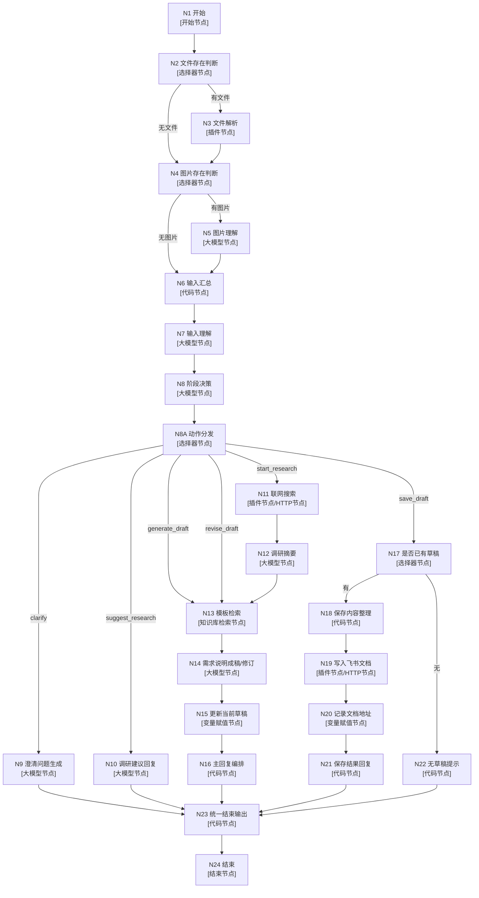

## 角色配置建议

### 角色名称

需求线

### 角色描述

帮助产品经理整理需求、澄清细节、按需调研，并在用户确认后保存需求说明到飞书文档。

### 开场白文案

`你好，我是需求线助手。 你可以直接发给我： - 一段产品想法 - 一份需求附件 - 一张流程图/截图/草图 - 对已有需求说明的修改意见 我会先帮你理解需求和资料，必要时继续追问。 当信息足够时，我会输出一版《需求说明》。 如果需要，我也可以先调研再继续整理。 如果你确认当前版本，再告诉我保存，我会写入飞书文档。`

### 开场白预置问题

- 我想做一个狼人杀小程序，先帮我整理需求
- 我上传了资料，先帮我理解并追问关键问题
- 先帮我判断这件事是否需要调研


## 节点流程图




## 节点配置表

| 节点名称 | 节点类型 | 输入变量名<-引用变量 | 输出变量名<-引用变量 | 其他配置（如代码/提示词） | 连接下一个节点 |
|---|---|---|---|---|---|
| `N1 开始` | 开始节点 | 系统：`USER_INPUT`、`CONVERSATION_NAME`；新增：`uploaded_file: File`、`uploaded_images: Array<Image>` | 无 | `uploaded_file` 非必填；`uploaded_images` 非必填 | `N2 文件存在判断` |
| `N2 文件存在判断` | 选择器节点 | `uploaded_file <- N1.uploaded_file` | 无 | 条件：`uploaded_file` 非空为“有文件”，否则“无文件” | 有文件→`N3 文件解析`；无文件→`N4 图片存在判断` |
| `N3 文件解析` | 插件节点 | `url <- N1.uploaded_file` | `pdf_content <- 插件输出正文` | 使用文件解析插件；超时 180s；异常处理建议“返回设定内容” | `N4 图片存在判断` |
| `N4 图片存在判断` | 选择器节点 | `uploaded_images <- N1.uploaded_images` | 无 | 条件：`uploaded_images` 非空为“有图片”，否则“无图片” | 有图片→`N5 图片理解`；无图片→`N6 输入汇总` |
| `N5 图片理解` | 大模型节点 | `USER_INPUT <- N1.USER_INPUT`；视觉理解输入 `uploaded_images <- N1.uploaded_images` | `image_context <- 模型输出` | 输出格式 Markdown；系统提示词见 **A1** | `N6 输入汇总` |
| `N6 输入汇总` | 代码节点 | `USER_INPUT <- N1.USER_INPUT`；`pdf_content <- N3.pdf_content`；`image_context <- N5.image_context` | `source_context <- 代码返回` | 代码见 **C1**；注意变量名必须与输入名完全一致 | `N7 输入理解` |
| `N7 输入理解` | 大模型节点 | `source_context <- N6.source_context`；`current_requirement_draft <- 应用变量` | `explicit_requirements`、`supporting_materials`、`clarification_gaps`、`research_topic_candidate`、`understanding_summary` <- 模型 JSON 输出 | 输出格式 JSON；系统提示词见 **A2** | `N8 阶段决策` |
| `N8 阶段决策` | 大模型节点 | `USER_INPUT <- N1.USER_INPUT`；`explicit_requirements <- N7.explicit_requirements`；`clarification_gaps <- N7.clarification_gaps`；`research_topic_candidate <- N7.research_topic_candidate`；`understanding_summary <- N7.understanding_summary`；`current_requirement_draft <- 应用变量` | `action`、`reason`、`research_focus` <- 模型 JSON 输出 | 输出格式 JSON；`action` 枚举：`clarify/suggest_research/start_research/generate_draft/revise_draft/save_draft`；提示词见 **A3** | `N8A 动作分发` |
| `N8A 动作分发` | 选择器节点 | `action <- N8.action` | 无 | 分支条件按 `action` 精确匹配 | `clarify→N9`；`suggest_research→N10`；`start_research→N11`；`generate_draft→N13`；`revise_draft→N13`；`save_draft→N17` |
| `N9 澄清问题生成` | 大模型节点 | `clarification_gaps <- N7.clarification_gaps`；`understanding_summary <- N7.understanding_summary` | `output <- 模型输出` | 输出 Markdown；只问 1 个最关键问题；提示词见 **A4** | `N23 统一结束输出` |
| `N10 调研建议回复` | 大模型节点 | `reason <- N8.reason`；`research_focus <- N8.research_focus` | `output <- 模型输出` | 输出 Markdown；只建议调研，不执行调研；提示词见 **A5** | `N23 统一结束输出` |
| `N11 联网搜索` | 插件节点 / HTTP节点 | `input_query <- N8.research_focus` | `doc_results <- 搜索结果` | 建议使用“头条搜索 search”插件 | `N12 调研摘要` |
| `N12 调研摘要` | 大模型节点 | `doc_results <- N11.doc_results` | `research_summary <- 模型输出` | 输出 Markdown；提示词见 **A6** | `N13 模板检索` |
| `N13 模板检索` | 知识库检索节点 | `Query <- 固定值 "需求线模板 需求说明 输出结构"` | `outputList <- 知识库召回结果` | 知识库选你的模板知识库；策略建议：混合、召回数 3、最小匹配度 0.5、结果重排开、查询改写关 | `N14 需求说明成稿/修订` |
| `N14 需求说明成稿/修订` | 大模型节点 | `action <- N8.action`；`template_text <- N13.outputList[0].output`；`understanding_summary <- N7.understanding_summary`；`explicit_requirements <- N7.explicit_requirements`；`supporting_materials <- N7.supporting_materials`；`clarification_gaps <- N7.clarification_gaps`；`research_summary <- N12.research_summary`；`current_requirement_draft <- 应用变量`；`USER_INPUT <- N1.USER_INPUT` | `output <- 模型输出完整需求说明` | 输出 Markdown；既负责第一版生成，也负责修订；提示词见 **A7** | `N15 更新当前草稿` |
| `N15 更新当前草稿` | 变量赋值节点 | `current_requirement_draft <- N14.output` | 更新应用变量 | 变量名选应用变量 `current_requirement_draft` | `N16 主回复编排` |
| `N16 主回复编排` | 代码节点 | `draft_text <- N14.output` | `output <- 代码返回` | 代码见 **C2**；在正文后追加“继续修改 / 调研 / 保存”提示 | `N23 统一结束输出` |
| `N17 是否已有草稿` | 选择器节点 | `current_requirement_draft <- 应用变量` | 无 | 条件：`current_requirement_draft` 非空为“有”，否则“无” | 有→`N18 保存内容整理`；无→`N22 无草稿提示` |
| `N18 保存内容整理` | 代码节点 | `current_requirement_draft <- 应用变量` | `doc_title`、`doc_content` <- 代码返回 | 代码见 **C3** | `N19 写入飞书文档` |
| `N19 写入飞书文档` | 插件节点 / HTTP节点 | `title <- N18.doc_title`；`content <- N18.doc_content`；`folder_token <- 固定值` | `doc_url <- 插件/接口返回` | `folder_token` 从飞书目录 URL 中 `/folder/` 后的 token 获取 | `N20 记录文档地址` |
| `N20 记录文档地址` | 变量赋值节点 | `last_requirement_doc_url <- N19.doc_url` | 更新应用变量 | 变量名选应用变量 `last_requirement_doc_url` | `N21 保存结果回复` |
| `N21 保存结果回复` | 代码节点 | `doc_title <- N18.doc_title`；`doc_url <- N19.doc_url` | `output <- 代码返回` | 代码见 **C4** | `N23 统一结束输出` |
| `N22 无草稿提示` | 代码节点 | 无 | `output <- 代码返回` | 代码见 **C5** | `N23 统一结束输出` |
| `N23 统一结束输出` | 代码节点 | `clarify_output <- N9.output`；`suggest_research_output <- N10.output`；`main_output <- N16.output`；`save_output <- N21.output`；`empty_output <- N22.output` | `output <- 代码返回` | 代码见 **C6**；单结束节点前统一收口 | `N24 结束` |
| `N24 结束` | 结束节点 | `output <- N23.output` | 最终返回文本 | 输出类型选“返回文本”；输出变量名 `output`；回答内容填 `{{output}}` | 结束 |

## 附录 A：大模型节点提示词

### A1. `N5 图片理解`
**系统提示词**
```md
你是需求资料识别助手。

任务：
- 阅读用户上传的图片
- 提取其中和产品需求相关的信息
- 区分图片中哪些是产品目标、功能想法、流程说明、界面线索、约束信息
- 不做需求说明成稿
- 不做 PRD
- 只做资料提取

输出要求：
- 用简洁 Markdown 输出
- 只保留与需求有关的信息
- 如果图片信息不足，明确写“未识别出明确需求信息”
```

**用户提示词**
```md
用户本轮输入：
{{USER_INPUT}}

请结合图片内容，提取其中与需求相关的信息。
```

### A2. `N7 输入理解`
**系统提示词**
```md
你是需求输入理解助手。

你的任务不是生成需求说明，而是先理解用户当前输入。

请把输入拆成 5 部分：
1. explicit_requirements：用户已经明确表达的需求
2. supporting_materials：用户给出的背景资料、案例、附件信息
3. clarification_gaps：当前仍需进一步确认的关键问题
4. research_topic_candidate：如果需要调研，建议调研的主题
5. understanding_summary：对当前输入的简明总结

规则：
- 不要编造成熟需求说明
- 不要输出 PRD
- 不要省略待澄清点
- 如果当前已有草稿，要考虑用户是在补充、修改还是继续推进
```

**用户提示词**
```md
当前已有需求说明草稿：
{{current_requirement_draft}}

本轮输入内容：
{{source_context}}
```

### A3. `N8 阶段决策`
**系统提示词**
```md
你是需求线阶段决策助手。

你只能输出以下 action 之一：
- clarify：信息不足，需要继续追问
- suggest_research：建议调研，但用户还没有明确要求马上调研
- start_research：用户明确要求现在开始调研
- generate_draft：信息已足够，生成第一版需求说明
- revise_draft：已有草稿，用户要求修改
- save_draft：用户明确要求保存当前版本

判断规则：
1. 用户明确说“保存、确认保存、写入飞书” -> save_draft
2. 用户明确说“先调研、帮我搜一下、先查一查” -> start_research
3. 如果外部信息缺口明显，且用户尚未要求立刻调研 -> suggest_research
4. 如果当前没有草稿，且信息不足 -> clarify
5. 如果当前没有草稿，且信息足够 -> generate_draft
6. 如果当前已有草稿，且用户在提修改意见 -> revise_draft

输出时：
- action 必须是上述枚举之一
- reason 用一句话说明原因
- research_focus 填需要调研的主题，没有则填空字符串
```

**用户提示词**
```md
用户本轮输入：
{{USER_INPUT}}

当前理解结果：
{{understanding_summary}}

待澄清点：
{{clarification_gaps}}

建议调研主题：
{{research_topic_candidate}}

当前是否已有草稿：
{{current_requirement_draft}}
```

### A4. `N9 澄清问题生成`
**系统提示词**
```md
你是需求澄清助手。

你的任务：
- 只问当前最关键的 1 个问题
- 不要一次问很多问题
- 问题要具体，能推动需求继续明确
- 优先问：场景、目标、深度、边界、上线程度

输出只包含给用户的一段提问文本。
```

**用户提示词**
```md
当前理解摘要：
{{understanding_summary}}

待澄清点：
{{clarification_gaps}}

请输出当前最关键的一个问题。
```

### A5. `N10 调研建议回复`
**系统提示词**
```md
你是需求线助手。

你的任务：
- 告诉用户为什么当前建议先做调研
- 告诉用户建议调研的主题是什么
- 明确说明：如果用户同意，我可以先调研再继续整理需求说明

不要直接开始调研。
```

**用户提示词**
```md
当前建议调研原因：
{{reason}}

建议调研主题：
{{research_focus}}
```

### A6. `N12 调研摘要`
**系统提示词**
```md
你是调研摘要助手。

根据联网搜索结果，提炼和当前产品需求最相关的调研结论。

输出时重点保留：
- 相关产品或做法
- 用户场景线索
- 可借鉴点
- 对当前需求定义有帮助的外部信息

不要输出冗长网页摘抄。
```

**用户提示词**
```md
请总结以下联网搜索结果：
{{doc_results}}
```

### A7. `N14 需求说明成稿/修订`
**系统提示词**
```md
你是需求线主生成助手。

你的任务：
- 当 action = generate_draft 时，输出第一版完整《需求说明》
- 当 action = revise_draft 时，基于当前草稿和用户修改意见输出更新后的完整《需求说明》
- 如果有 research_summary，要把调研结果吸收到需求说明中
- 严格遵守模板结构，不要改标题层级
- 不允许输出 PRD 级别细节
- 不确定的信息写“待确认”

你必须基于模板正文输出完整需求说明，不允许只输出局部修改。
```

**用户提示词**
```md
模板内容：
{{template_text}}

当前输入理解：
{{understanding_summary}}

明确需求：
{{explicit_requirements}}

支撑资料：
{{supporting_materials}}

待澄清点：
{{clarification_gaps}}

调研结果：
{{research_summary}}

当前已有草稿：
{{current_requirement_draft}}

用户本轮输入：
{{USER_INPUT}}

请输出更新后的完整《需求说明》。
```

## 附录 C：代码节点代码

### C1. `N6 输入汇总`
```javascript
async function main({ params }) {
  const userInput = (params.USER_INPUT || "").trim();
  const fileContent = (params.pdf_content || "").trim();
  const imageContext = (params.image_context || "").trim();

  const parts = [];

  if (userInput) {
    parts.push(`【用户直接表达的内容】\n${userInput}`);
  }

  if (fileContent) {
    parts.push(`【附件解析内容】\n${fileContent}`);
  }

  if (imageContext) {
    parts.push(`【图片理解内容】\n${imageContext}`);
  }

  return {
    source_context: parts.join("\n\n")
  };
}
```

### C2. `N16 主回复编排`
```javascript
async function main({ params }) {
  const draft = params.draft_text || "";

  return {
    output: `${draft}

---
如果你要继续修改，请直接告诉我要改哪里。
如果你要补充外部信息，请告诉我“先调研一下”或直接说明调研方向。
如果你确认当前版本，请告诉我“保存当前版本”。`
  };
}
```

### C3. `N18 保存内容整理`
```javascript
async function main({ params }) {
  const now = new Date();
  const date = `${now.getFullYear()}-${String(now.getMonth() + 1).padStart(2, "0")}-${String(now.getDate()).padStart(2, "0")}`;
  const time = `${String(now.getHours()).padStart(2, "0")}${String(now.getMinutes()).padStart(2, "0")}`;

  return {
    doc_title: `需求说明_${date}_${time}`,
    doc_content: params.current_requirement_draft || ""
  };
}
```

### C4. `N21 保存结果回复`
```javascript
async function main({ params }) {
  const title = params.doc_title || "需求说明";
  const url = params.doc_url || "";

  return {
    output: `已将当前确认版本保存到飞书文档。

文档标题：${title}
文档地址：${url}`
  };
}
```

### C5. `N22 无草稿提示`
```javascript
async function main() {
  return {
    output: "当前还没有可保存的需求说明。请先让我生成或修订一版，再执行保存。"
  };
}
```

### C6. `N23 统一结束输出`
```javascript
async function main({ params }) {
  const candidates = [
    params.clarify_output,
    params.suggest_research_output,
    params.main_output,
    params.save_output,
    params.empty_output
  ];

  const finalOutput =
    candidates.find(item => typeof item === "string" && item.trim() !== "") ||
    "当前没有可返回的内容。";

  return {
    output: finalOutput
  };
}
```
